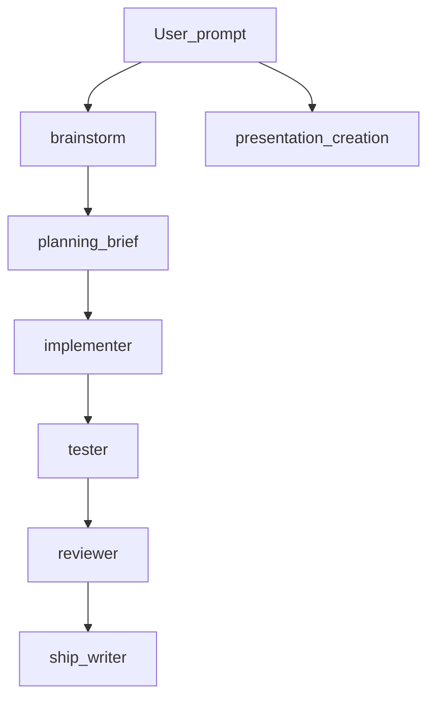

# Cursor-Workbench

A **copy-paste Cursor kit**: skills, subagents, and an **optional** local log
hook. Drop the folders you want into a project’s `.cursor/` and use the
defaults below. No global install, no required cloud service.

**Last doc refresh:** 2026-04-24 — Cursor’s skill/hook behavior can evolve; if
something no longer autoloads, check Cursor’s docs for your version.

## What this is (and is not)

| In scope | Out of scope (non-goals) |
| --- | --- |
| Reusable **skills** and **subagent** prompts for a consistent agent workflow | A fork of any other public “agent kit” repo; this tree is **standalone** |
| **Optional** project hooks that only append to a local log and **never block** the editor | Product decisions for your org (you still own process and compliance) |
| A **default path** (clarify → implement → test → review → ship) you can share with peers | Replacement for code review, security review, or your CI pipeline |

## Architecture (default workflow)



- Use **brainstorm** when the ask is **fuzzy**; use **planning-brief** when
  the direction is clear but **ordering** is not.
- **Subagents** are plain markdown personas you (or a meta-prompt) invoke for a
  single role — see [subagents/](subagents/).

## What’s in the box

### Skills (`.cursor/skills/<name>/skills.md`)

| Skill | One line | Example trigger phrase |
| --- | --- | --- |
| [brainstorm](skills/brainstorm/skills.md) | Resolve ambiguity before code; 1% doubt → ask. | "brainstorm with me", "let’s clarify" |
| [planning-brief](skills/planning-brief/skills.md) | One-page plan: options, pick, ordered next steps. | "help me plan the approach" |
| [presentation-creation](skills/presentation-creation/skills.md) | Markdown content → static HTML deck via layout catalog. | "build a deck from `docs/talk.md`" |

`presentation-creation` needs a **`styles.css`** you supply; see
[ASSETS_FOR_DECKS.md](skills/presentation-creation/ASSETS_FOR_DECKS.md).

### Subagents (`.cursor/subagents/<role>/subagent.md`)

| Role | Use |
| --- | --- |
| [implementer](subagents/implementer/subagent.md) | Code from an agreed BRIEF or plan. |
| [tester](subagents/tester/subagent.md) | Tests tied to accept criteria. |
| [reviewer](subagents/reviewer/subagent.md) | `VERDICT: PASS|RETRY|FAIL` style review. |
| [ship-writer](subagents/ship-writer/subagent.md) | PR text, verify steps, optional `RUN.md` notes. |

**Default path for peers:** *brainstorm* (if fuzzy) → *planning-brief* or BRIEF
→ *implementer* + *tester* in parallel if your team does that → *reviewer* →
*ship-writer*.

### Hooks (optional)

See [hooks/README.md](hooks/README.md). Local log only: [hooks/local-jsonl-log](hooks/local-jsonl-log).

## Quickstart (5 minutes)

```bash
cd /path/to/your/project
mkdir -p .cursor/skills .cursor/subagents
cp -R /path/to/cursor-workbench/skills/brainstorm .cursor/skills/
cp -R /path/to/cursor-workbench/skills/planning-brief .cursor/skills/
cp -R /path/to/cursor-workbench/subagents/* .cursor/subagents/
# Optional deck skill + optional hook — only if you need them
# cp -R /path/to/cursor-workbench/skills/presentation-creation .cursor/skills/
# cp -R /path/to/cursor-workbench/hooks/local-jsonl-log/.cursor .  # merge hooks.json with care; see hook README
```

Restart Cursor, then in chat try:

> Use the **brainstorm** skill. I want to add a read-only API to our
> `customers` table — I’m not sure about pagination yet.

**Worked example (planning-brief):**

> Use **planning-brief** to outline how we split a large SQL migration into
> safe, reviewable PRs.

**Worked example (deck):**

> Use **presentation-creation** with **ambiguous-only** mode; content file
> `docs/deck.md`, output `out/deck/`. (Add `styles.css` per
> [ASSETS_FOR_DECKS.md](skills/presentation-creation/ASSETS_FOR_DECKS.md) for
> final visuals.)

## Team conventions (short)

- **Spec / BRIEF:** for anything multi-PR, keep a single `FEATURE.md` or ticket
  “acceptance” section as source of truth; the **brainstorm** BRIEF should
  point to it.
- **Branch naming:** follow your org — this kit does not pick a convention;
  keep `feat/…`, `fix/…` consistent within the team.
- **Definition of done for agent-assisted work:** *reviewer* `VERDICT: PASS`,
  required tests present, and **ship-writer** summary includes **how to verify**
  (command or click path).
- **Hooks / logs:** never commit `CURSOR_WB_LOG_DIR` if it ever lives under the
  repo; use `CURSOR_WB_LOG_DIR=…` in your shell, not a committed `.env` with
  real paths to secrets.
- **Telemetry:** the bundled hook is **file-only**; if you add cloud
  observability, do that under a separate, reviewed config.

## Design principles

1. **Clarify before you code** when *what* or *how* is under-specified.
2. **Adversarial review** — the reviewer’s job is to find real failure, not
   to rubber-stamp.
3. **Fail open on hooks** — the editor must stay usable if a script fails.
4. **Stack-agnostic** subagents; point them at the repo and tests that already
   exist.
5. **No secrets in git** — this repository is meant to be **public-safe**.

## Repo layout

```text
cursor-workbench/
  README.md
  LICENSE
  .gitignore
  docs/future.md
  skills/           # Cursor skills (per-folder skills.md)
  subagents/        # Role prompts
  hooks/            # Optional hook bundle(s)
```

## Verification checklist (before you tell peers "it works")

- [ ] From a test project, one skill auto-loads when you use a trigger phrase.
- [ ] `git status` in **this** repo is clean of `.env`, `.venv`, and log
  files from hooks.
- [ ] `rg -i 'api_key|sk-|BEGIN PRIVATE' .` in this repo returns no hits
  in tracked files (adjust patterns for your org).

## License

[MIT](LICENSE). Skills and subagent text in this repository are provided as-is
for adaptation in your own repos and internal playbooks.
