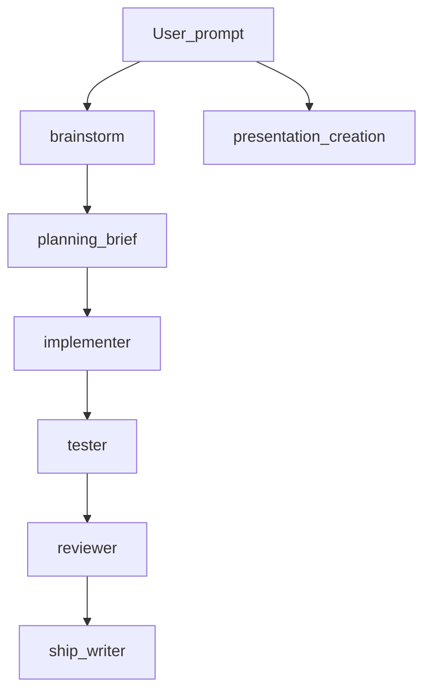

# Cursor-Workbench

[](LICENSE)

A **copy-paste [Cursor](https://cursor.com)** kit: **project rules** (`.mdc`), **agent skills**, **subagent** personas, a **redacted [MCP](https://github.com/cursor/mcp) config example**, and **optional** hooks (local file log, [Langfuse](https://langfuse.com) telemetry, MCP write guard).  
Use what you need in a project’s **`.cursor/`** or in your **user** Cursor config — [full install steps](docs/SETUP.md). No global installer.

**Repository:** [github.com/abhinavsinhanutan/Cursor-Workbench](https://github.com/abhinavsinhanutan/Cursor-Workbench)  
**Live site (GitHub Pages):** [abhinavsinhanutan.github.io/Cursor-Workbench](https://abhinavsinhanutan.github.io/Cursor-Workbench/) (enable **Settings → Pages → `/docs` on `main`** if the site 404s)

**Last doc refresh:** 2026-04 (update when you change the tree meaningfully). Cursor’s skill and hook behavior can differ by version — check Cursor’s docs if something does not autoload.

**Security:** [SECURITY.md](SECURITY.md) — enable **GitHub → Settings → Code security and analysis (secret scanning)**; never copy your real workspace `mcp.json` (e.g. `~/…/GitHub/.cursor/mcp.json`) into this repo, only [config/mcp.json.example](config/mcp.json.example).

---

## Contents

- [What this is](#what-this-is-and-is-not)
- [Get the repo](#get-the-repo)
- [Default workflow](#architecture-default-workflow)
- [What’s in the box](#whats-in-the-box)
- [Quickstart](#quickstart)
- [Team conventions](#team-conventions-short)
- [Design principles](#design-principles)
- [Repository layout](#repository-layout)
- [Verify before you share](#verification-checklist-before-you-tell-peers-it-works)
- [License](#license)
- [Security / secrets](SECURITY.md)

---

## What this is (and is not)

| In scope | Out of scope (non-goals) |
| --- | --- |
| Reusable **rules**, **skills**, and **subagent** prompts for a consistent agent workflow | A fork of another public “agent kit” — this tree is **standalone** |
| **Optional** hooks that **fail open** (file log, Langfuse, MCP guard) | Your org’s product, compliance, and review process |
| **[config/mcp.json.example](config/mcp.json.example)** — placeholders only | A committed **real** `mcp.json` with live API keys or PATs |
| A **default path** (clarify → plan → implement → test → review → ship) you can share with peers | A substitute for human code review, security sign-off, or CI policy |

## Get the repo

```bash
git clone https://github.com/abhinavsinhanutan/Cursor-Workbench.git
cd Cursor-Workbench
# Then copy pieces into a target project; see Quickstart and docs/SETUP.md
export CURSOR_WB_ROOT="$(pwd)"   # optional: use in copy commands below
```

Or download a ZIP from GitHub and use the same paths relative to the extracted folder.

## Architecture (default workflow)



- **brainstorm** — use when the ask is still **fuzzy** (1% doubt → ask).
- **planning-brief** — use when direction is clear but **ordering** or **options** are not.
- **Subagents** — see [subagents/](subagents/); invoke one role or chain them in chat.

**Deep dive:** [docs/SETUP.md](docs/SETUP.md) (rules, MCP, hooks, merging `hooks.json`). **AGENTS.md starter:** [docs/AGENTS.template.md](docs/AGENTS.template.md).

## What’s in the box

### Rules — [rules/](rules/) → `.cursor/rules/*.mdc`

| Area | Files (examples) |
| --- | --- |
| Tooling & workflow | [token-efficiency.mdc](rules/token-efficiency.mdc), [default-ask-mode.mdc](rules/default-ask-mode.mdc), [boot-sequence.mdc](rules/boot-sequence.mdc) |
| Integrations | [atlassian-mcp-guardrails.mdc](rules/atlassian-mcp-guardrails.mdc), [browser-mcp-charlotte-playwright.mdc](rules/browser-mcp-charlotte-playwright.mdc) |
| Data / guardrails | [data-eng-workflow-guardrails.mdc](rules/data-eng-workflow-guardrails.mdc), [informatica-no-writes.mdc](rules/informatica-no-writes.mdc) |
| Meta | [self-improvement.mdc](rules/self-improvement.mdc) |

Copy the whole folder or individual `.mdc` files; merge with care if you already have project rules.

### MCP — [config/](config/) (templates only; **no** real secrets in git)

| Doc | What it is |
| --- | --- |
| [config/mcp.json.example](config/mcp.json.example) | **Commit-safe** JSON: `code-review-graph`, `charlotte`, `playwright`, optional **Tableau** (placeholders for URL, path, PAT). |
| [config/MCP.md](config/MCP.md) | **Per-server** guide: what you type vs what is secret, and that Cursor **may not** auto-prompt for every token — you fill **Settings → MCP** or a private `mcp.json` once. |
| [config/.env.example](config/.env.example) | Optional **worksheet** for Tableau `env` keys; copy to a local untracked file and transcribe into JSON. |

Copy `mcp.json.example` to `~/.cursor/mcp.json` or `<project>/.cursor/mcp.json` and **replace every placeholder** (this repo [ignores](.gitignore) `.cursor/mcp.json` to reduce accidental commits). **Never** commit real PATs or API keys.

### Skills — `.cursor/skills/<name>/skills.md`

| Skill | One line | Example trigger |
| --- | --- | --- |
| [brainstorm](skills/brainstorm/skills.md) | Resolve ambiguity before code; 1% doubt → ask. | "brainstorm with me", "let’s clarify" |
| [planning-brief](skills/planning-brief/skills.md) | One-page plan: options, pick, next steps. | "help me plan the approach" |
| [presentation-creation](skills/presentation-creation/skills.md) | Markdown → static HTML deck via the layout catalog. | "build a deck from `docs/talk.md`" |

`presentation-creation` expects a separate **`styles.css`** (org-specific); see [skills/presentation-creation/ASSETS_FOR_DECKS.md](skills/presentation-creation/ASSETS_FOR_DECKS.md) and [vendor/serve.py](skills/presentation-creation/vendor/serve.py) for local preview.

### Subagents — [subagents/](subagents/)

| Subagent | Purpose |
| --- | --- |
| [implementer](subagents/implementer/subagent.md) | Turn BRIEF/plan into code. |
| [tester](subagents/tester/subagent.md) | Tests from acceptance criteria. |
| [reviewer](subagents/reviewer/subagent.md) | `VERDICT: PASS \| RETRY \| FAIL`. |
| [ship-writer](subagents/ship-writer/subagent.md) | PR body, verify steps, stakeholder summary. |

**Typical order:** *brainstorm* (if needed) → *planning-brief* or BRIEF → *implementer* (and *tester*) → *reviewer* → *ship-writer*.

### Hooks — [hooks/README.md](hooks/README.md) · [docs/hooks.json.example](docs/hooks.json.example)

| Bundle | Role |
| --- | --- |
| [hooks/local-jsonl-log](hooks/local-jsonl-log) | Append hook stdin to a local log file; no third-party API. |
| [hooks/langfuse-cursor-hook](hooks/langfuse-cursor-hook) | Langfuse observations + [mcp-guard.sh](hooks/langfuse-cursor-hook/mcp-guard.sh) for MCP writes; run `install.sh` to create `.venv` locally. |

Merge `hooks.json` stanzas if you use more than one bundle; see [docs/SETUP.md](docs/SETUP.md) §4.

## Quickstart (about 5 minutes)

**1. Clone (or set `CURSOR_WB_ROOT` to this repo’s path on disk).**

**2. Copy into a project** (from the repo root or `$CURSOR_WB_ROOT`):

```bash
TARGET=/path/to/your/project
WB=${CURSOR_WB_ROOT:-/path/to/Cursor-Workbench}
mkdir -p "$TARGET/.cursor/skills" "$TARGET/.cursor/subagents" "$TARGET/.cursor/rules"
cp -R "$WB/skills/brainstorm" "$WB/skills/planning-brief" "$TARGET/.cursor/skills/"
cp -R "$WB/subagents"/* "$TARGET/.cursor/subagents/"
cp -R "$WB/rules"/* "$TARGET/.cursor/rules/"   # optional: merge if rules already exist
# Optional: presentation skill, hooks — see docs/SETUP.md
```

**3. Restart Cursor** and try a prompt:

> Use the **brainstorm** skill. I need a read-only API for our `customers` table and I’m unsure about pagination.

**Other examples**

- *planning-brief:* split a big SQL migration into small, reviewable PRs.
- *presentation-creation:* "ambiguous-only" mode, content `docs/deck.md`, output `out/deck/`, then add `styles.css` as documented.

**MCP and hooks** are optional; use [config/mcp.json.example](config/mcp.json.example) and [docs/SETUP.md](docs/SETUP.md) so you do not commit secrets.

## Team conventions (short)

- **Spec / BRIEF** — for multi-PR work, one `FEATURE.md` or ticket acceptance block is the source of truth; the **brainstorm** BRIEF should point at it.
- **Branches** — follow your org (`feat/…`, `fix/…`, etc.).
- **Definition of done** for agent-assisted changes: *reviewer* `VERDICT: PASS`, tests as agreed, and *ship-writer* includes **how to verify** (command or path).
- **Logs / telemetry** — do not commit `CURSOR_WB_LOG_DIR` data or Langfuse `.env` / `.venv` from hook installs.

## Design principles

1. **Clarify before you code** when *what* or *how* is under-specified.
2. **Adversarial review** — the reviewer’s job is to find real failure, not to rubber-stamp.
3. **Fail open on hooks** — a broken script must not brick the editor.
4. **Stack-agnostic** subagents where possible; point them at the repo you’re in.
5. **No secrets in git** — templates and examples only; rotate anything that ever leaked.

## Repository layout

```text
Cursor-Workbench/
  README.md
  SECURITY.md
  LICENSE
  .gitignore
  config/             # mcp.json.example, MCP.md, .env.example (no real credentials)
  docs/               # SETUP.md, AGENTS.template.md, hooks.json.example, future.md
  rules/              # .mdc rules
  skills/
  subagents/
  hooks/              # local-jsonl-log, langfuse-cursor-hook
```

## Verification checklist (before you tell peers "it works")

- [ ] In a test project, at least one **skill** responds to an expected trigger phrase.
- [ ] `git status` in **this** repo is clean: no `.env`, no hook `.venv`, no `langfuse.log` accidentally staged.
- [ ] Search the tracked tree for accidental secrets (e.g. `git grep -E 'api_key|sk-[A-Za-z0-9]{20,}'` or your org’s pattern); the example files should only contain **placeholders**.

## License

[MIT](LICENSE). Rules, skills, and subagent text are provided as-is for use and adaptation in your own repositories and playbooks.
